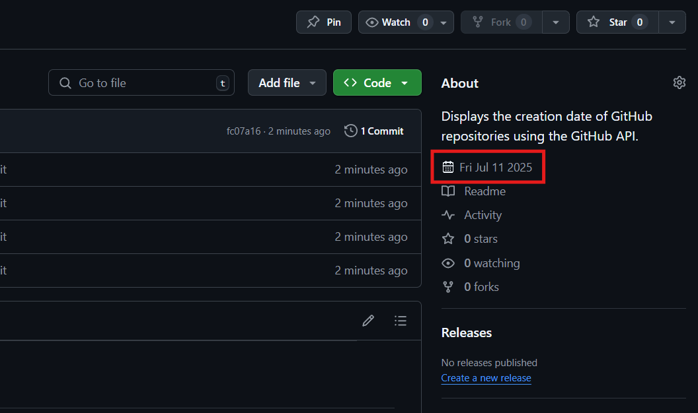

# 🗓️ Gitdate

This lightweight Chrome extension displays the **creation date** of any public GitHub repository, directly in the sidebar of the repository page.

---

## 🔍 Features

- Automatically fetches the repository creation date using the GitHub API
- Displays the date with a clean calendar icon inside the GitHub sidebar
- Works on all public GitHub repos
- No external dependencies
- Minimal and unobtrusive

---

## 🧪 Demo



---

## 🚀 Installation (Manual)

You can install the extension manually in your browser:

1. **Download or clone this repository**  
   ```bash
   git clone https://github.com/YOUR_USERNAME/github-repo-created-date.git
````

2. **Open Chrome and go to** `chrome://extensions/`

3. **Enable** "Developer Mode" (top-right)

4. Click **"Load unpacked"** and select the extension folder you downloaded

The creation date will now show on GitHub repository pages in the sidebar.

---

## 📦 Auto-Releases

This repository is configured with **GitHub Actions** to automatically build and publish new releases whenever a version tag is pushed.

### 🔁 How it works:

* When you push a tag like `v1.0.0`, the action:

  * Packages the extension into a `.zip`
  * Creates a GitHub release with that version
  * Attaches the `.zip` as a downloadable asset

### 🏷️ To trigger a release:

```bash
git tag v1.0.0
git push origin v1.0.0
```

The release will appear under [Releases](https://github.com/YOUR_USERNAME/github-repo-created-date/releases) with the extension `.zip`.

---

## 📁 Project Structure

```
📦 github-repo-created-date/
├── content.js           # Main script that runs on GitHub pages
├── manifest.json        # Chrome extension metadata
├── icons/               # Folder with 16x16, 48x48, and 128x128 icons
├── .github/workflows/   # GitHub Actions for auto-releasing
│   └── release.yml
└── README.md
```

---

## 🛠️ Developer Notes

* Uses GitHub's public REST API:
  `https://api.github.com/repos/:owner/:repo`
* Injects a `<p>` with an SVG calendar icon + creation date after the first sidebar `<p>` element

---

## 🔐 Permissions

The extension only runs on `https://github.com/*/*` pages and uses `activeTab` and `scripting` to inject its content.

No tracking, no analytics, no background scripts.

---

## 📄 License

MIT License

---

## 🤝 Contribute

Feel free to fork, open issues, or submit pull requests!
